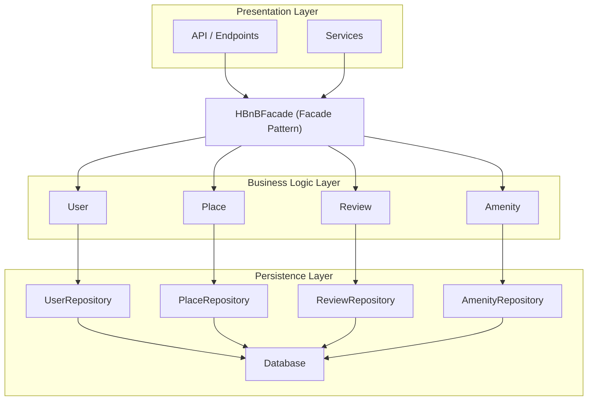
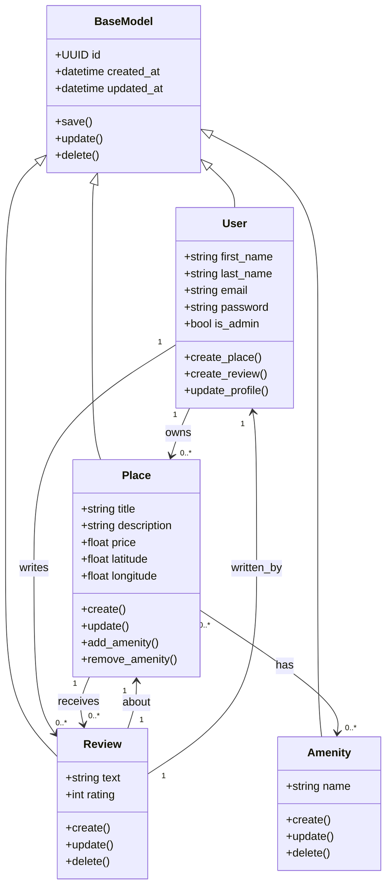
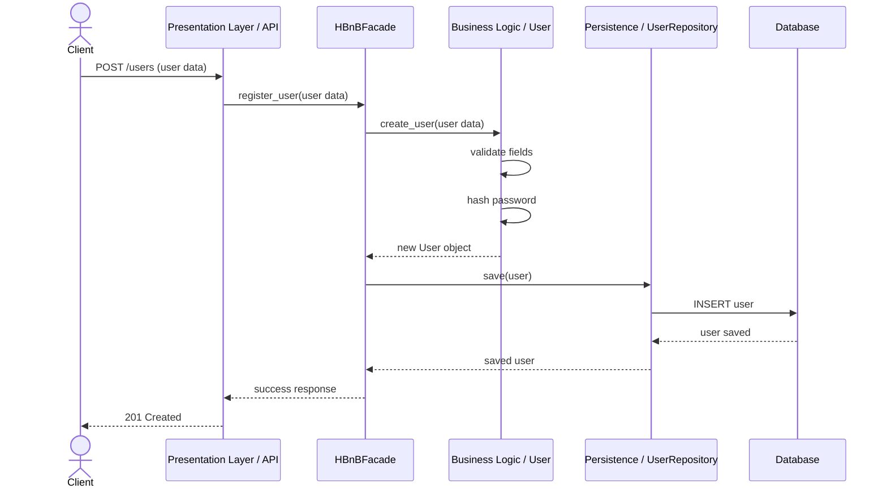
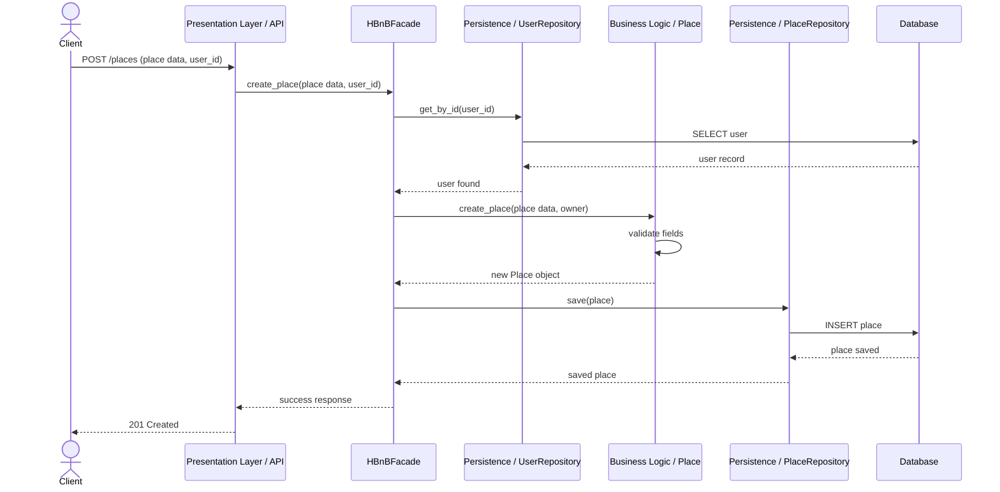
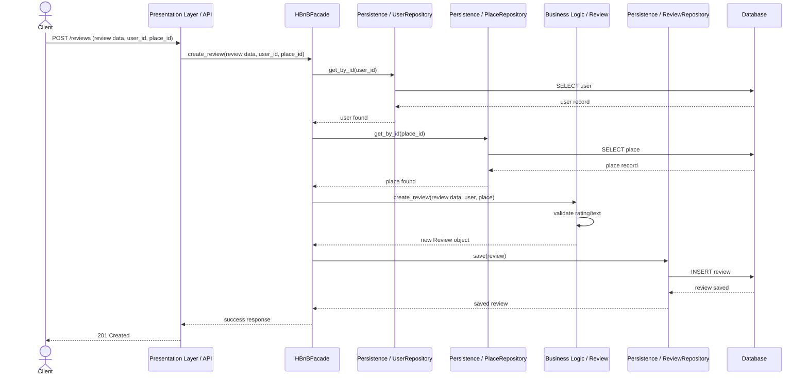
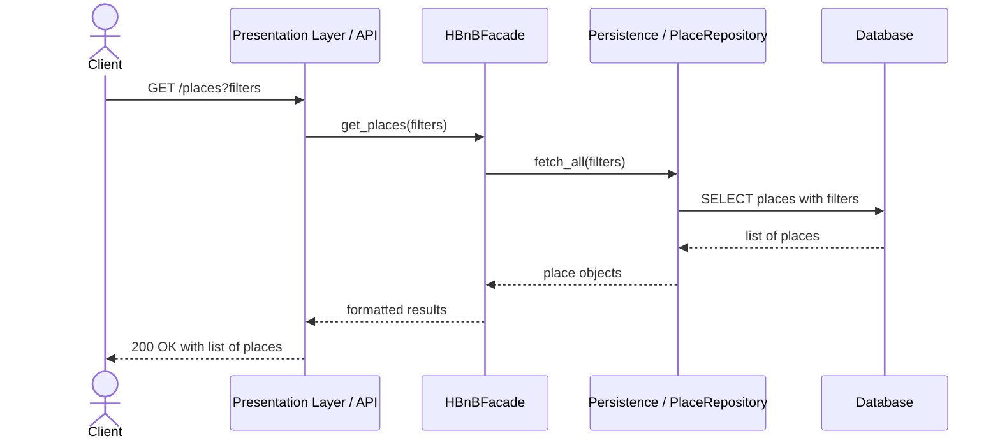

# HBnB Technical Documentation

## Introduction

This document provides a complete technical overview of the HBnB application. It serves as a blueprint for implementation by describing the system architecture, core business entities, and API interaction flows.

The application follows a three-layer architecture:
- Presentation Layer (API & Services)
- Business Logic Layer (Models)
- Persistence Layer (Database & Repositories)

A Facade pattern is used to simplify communication between layers and centralize operations.

---

# 1. High-Level Architecture

## Purpose

This diagram provides a conceptual overview of the HBnB system, showing how layers are structured and how they interact via the facade.

## Diagram

## Explanation

### Presentation Layer
The Presentation Layer handles interaction between clients and the system. It contains the API endpoints and services that receive requests and send responses. Its responsibilities include request handling, basic validation, and forwarding operations to the facade.

### Facade
The `HBnBFacade` acts as the unified entry point between the Presentation Layer and the lower layers. Instead of allowing the API to directly communicate with business entities and repositories, the facade centralizes system operations.

This improves:
- separation of concerns
- maintainability
- readability
- reduced coupling between layers

### Business Logic Layer
The Business Logic Layer contains the core entities:
- `User`
- `Place`
- `Review`
- `Amenity`

This layer is responsible for domain rules, validation logic, and interactions between entities.

### Persistence Layer
The Persistence Layer manages repositories and database interaction. Its role is to save, retrieve, update, and delete data while keeping storage details hidden from the business layer.

### Communication Flow
1. The client sends a request to the API.
2. The API forwards the request to the facade.
3. The facade coordinates the required business logic.
4. The business layer communicates with repositories.
5. Repositories interact with the database.
6. The result is returned back through the facade to the API and then to the client.

---

# 2. Business Logic Layer

## Purpose

This diagram shows the internal structure of the core entities in the Business Logic Layer, including their attributes, methods, and relationships.

## Diagram

## Explanation

### BaseModel
`BaseModel` is the parent class for all main entities.

**Attributes**
- `id`: unique identifier using UUID4
- `created_at`: creation timestamp
- `updated_at`: last update timestamp

**Methods**
- `save()`: stores the object
- `update()`: updates object fields
- `delete()`: removes the object

### User
The `User` class represents a person using the system.

**Attributes**
- `first_name`
- `last_name`
- `email`
- `password`
- `is_admin`

**Methods**
- `create_place()`
- `create_review()`
- `update_profile()`

**Role**
A user can own places and write reviews.

### Place
The `Place` class represents a listing on the platform.

**Attributes**
- `title`
- `description`
- `price`
- `latitude`
- `longitude`

**Methods**
- `create()`
- `update()`
- `add_amenity()`
- `remove_amenity()`

**Role**
A place belongs to a user, receives reviews, and can have multiple amenities.

### Review
The `Review` class represents feedback submitted by a user for a place.

**Attributes**
- `text`
- `rating`

**Methods**
- `create()`
- `update()`
- `delete()`

**Role**
A review connects a user to a place through ratings and comments.

### Amenity
The `Amenity` class represents a feature or service available in a place.

**Attributes**
- `name`

**Methods**
- `create()`
- `update()`
- `delete()`

**Role**
Amenities enrich place descriptions and can be shared across multiple places.

## Relationships

### Inheritance
`User`, `Place`, `Review`, and `Amenity` inherit from `BaseModel`. This ensures that all entities share a common ID and timestamps.

### User to Place
- One `User` can own zero or many `Place` objects.
- One `Place` belongs to one `User`.

### User to Review
- One `User` can write zero or many `Review` objects.
- One `Review` is written by one `User`.

### Place to Review
- One `Place` can receive zero or many `Review` objects.
- One `Review` is about one `Place`.

### Place to Amenity
- One `Place` can have zero or many `Amenity` objects.
- One `Amenity` can belong to zero or many `Place` objects.

---

# 3. API Interaction Flow

## Purpose

These sequence diagrams show how requests move through the system and how the Presentation Layer, Business Logic Layer, and Persistence Layer interact.

---

## 3.1 User Registration

### Diagram

### Explanation

1. The client sends registration data to the API.
2. The API forwards the request to the facade.
3. The facade asks the `User` model to validate and create the user.
4. The password is processed before persistence.
5. The facade sends the new user to the repository.
6. The repository saves the record to the database.
7. The response returns back through the facade and API to the client.

This flow ensures that validation and object creation happen before storage.

---

## 3.2 Place Creation

### Diagram

### Explanation

1. The client sends place data and the user ID.
2. The API sends the request to the facade.
3. The facade checks whether the owner exists.
4. The `Place` model validates the place data.
5. A new place object is created.
6. The repository saves the place in the database.
7. The response is returned to the client.

This guarantees that a place is only created for a valid user.

---

## 3.3 Review Submission

### Diagram

### Explanation

1. The client sends review data with the user and place IDs.
2. The API forwards the request to the facade.
3. The facade verifies that the user exists.
4. The facade verifies that the place exists.
5. The `Review` model validates the review text and rating.
6. The repository saves the review in the database.
7. The success response is returned to the client.

This ensures that reviews are only created for valid users and places.

---

## 3.4 Fetching a List of Places

### Diagram

### Explanation

1. The client requests a list of places, optionally with filters.
2. The API forwards the request to the facade.
3. The facade asks the repository for matching places.
4. The repository queries the database.
5. The results are returned back through the facade and API.

This flow keeps filtering and storage logic inside the lower layers.

---

# 4. Design Decisions

## Layered Architecture
The system is divided into layers to separate responsibilities:
- Presentation for handling requests
- Business Logic for domain rules
- Persistence for storage

This improves maintainability and clarity.

## Facade Pattern
The facade is used to:
- reduce direct dependencies
- centralize operations
- simplify communication between layers

## BaseModel
A shared base class ensures:
- consistent structure
- shared timestamps and IDs
- reduced duplication

## Repository Pattern
Repositories keep database access separate from business rules, making the system easier to test and maintain.

---

# 5. Conclusion

This document presents the main technical diagrams and explanations needed to understand the HBnB architecture and design. It includes the high-level structure, the Business Logic Layer model design, and four key API interaction flows.

